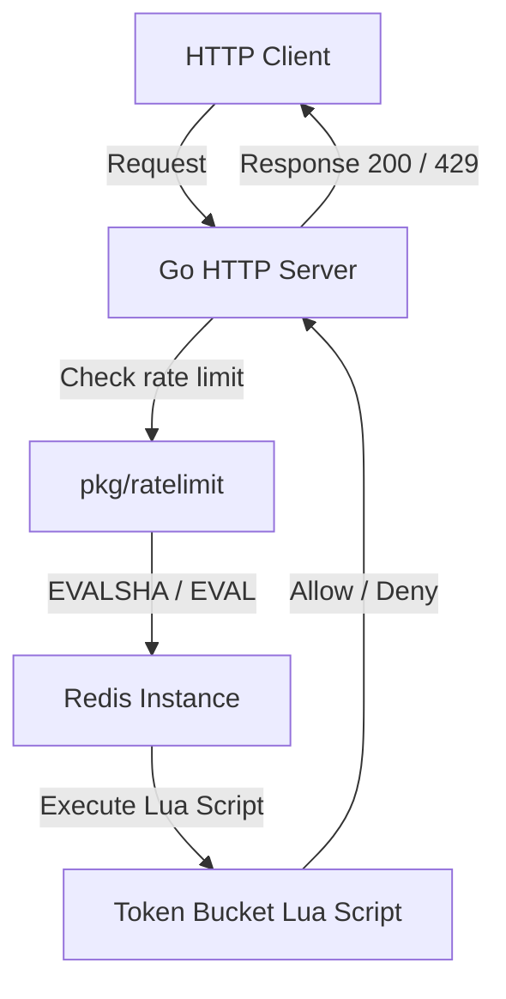

# Distributed Rate Limiter

A high-performance, distributed rate limiter implementation in Go using the **Token Bucket** strategy backed by **Redis** and **Lua scripting**.

This rate limiter is designed for high-concurrency environments, ensuring atomicity and consistency across multiple distributed instances without race conditions or clock drift issues.

---

## Architecture Overview



---

## Features

- **Distributed Token Bucket Algorithm:** Uses Redis for state storage and dynamic token accumulation.
- **Atomic Operations:** Uses a Redis Lua script to query and update the bucket state atomically, preventing race conditions.
- **Server Clock Synchronization:** Retrieves current time from the Redis server (`redis.call('TIME')`) so rate limiting stays synchronized across all application nodes regardless of individual machine clock drifts.
- **EVALSHA Performance Optimization:** Pre-loads the Lua script into Redis at startup and executes requests via `EVALSHA` to minimize network overhead.
- **Connection Cache Manager:** Caches and reuses Redis clients by address to prevent connection/thread pool exhaustion.
- **Concurrency-Safe Server:** Implements a thread-safe double-checked lock pattern on the Go server side to safely manage multiple rate limiter instances concurrently.
- **Per-IP Rate Limiting:** Identifies client IPs via reverse proxy headers (`X-Forwarded-For`, `X-Real-IP`) or connection remote address, allocating separate rate limit buckets per client IP.
- **HTTP Response Headers:** Returns standard rate limiting headers (`X-RateLimit-Limit`, `X-RateLimit-Remaining`, `X-RateLimit-Reset`, `Retry-After`) with response metadata.
- **Dynamic Quotas in Redis:** Stores path-specific configurations in Redis (`rate_limit_configs` hash), allowing custom rate limits per route with longest prefix matching and local in-memory caching.

---

## Project Structure

```
.
├── cmd/
│   └── server/
│       └── main.go       # Go HTTP server demonstrating rate-limiter & metrics usage
├── pkg/
│   └── ratelimit/
│       ├── limiter.go     # Core rate limiting logic and constructor
│       ├── limiter_test.go# Unit & integration tests with metrics assertions
│       ├── lua.go         # Token bucket Lua script definition
│       ├── metrics.go     # Prometheus metrics registration & definitions
│       └── redis.go       # Cached Redis client connection pool manager
├── grafana/
│   └── provisioning/
│       └── datasources/
│           └── datasource.yml # Autoprovisioned Grafana datasource config
├── docker-compose.yml     # Local services orchestration
├── prometheus.yml         # Prometheus scraping config
├── go.mod
├── go.sum
└── README.md
```

---

## Metrics & Monitoring (Grafana + Prometheus)

This project has built-in integration with **Prometheus** for metrics collection and **Grafana** for dashboard visualization.

### Local Setup (Using Docker Compose)

To spin up a local instance of Redis, Prometheus, and Grafana:

1. Start the Docker services:
   ```bash
   docker compose up -d
   ```
   This will start:
   - **Redis** on port `6379`
   - **Prometheus** on port `9090` (pre-configured to scrape the Go server)
   - **Grafana** on port `3000` (pre-provisioned with Prometheus as the default data source)

2. Run the Go server locally:
   ```bash
   go run cmd/server/main.go
   ```

3. Open Grafana at `http://localhost:3000` (Default credentials: `admin` / `admin`). You can immediately create dashboards utilizing the following exposed metrics:
   - `ratelimit_requests_total`: Counter tracking evaluations (labeled by `resource_hash` and `status` as `allowed` / `rejected` / `error`).
   - `ratelimit_redis_latency_seconds`: Histogram logging Redis Lua execution times.

---

## Getting Started

### Prerequisites

- Go (1.24 or higher)
- Redis server running on `localhost:6379` (either local or via Docker Compose)

### Running the Server

Start the Go HTTP server:

```bash
go run cmd/server/main.go
```

The server will start listening on port `:8091`. Every request to the server is rate-limited using the Token Bucket strategy and has telemetry exposed at `:8091/metrics`.

### Running Tests

Execute the unit/integration tests (which automatically verify metrics collection):

```bash
go test -v ./pkg/ratelimit/...
```

---

## Dynamic Rate Limit Configurations

The server fetches endpoint quotas dynamically from Redis using the hash key `rate_limit_configs`. 

### Seeded Quotas (Auto-populated on Startup)

On startup, the Go server automatically seeds the following default quotas into Redis:

| Key Prefix | Capacity | Window | Format (`capacity:window`) |
|---|---|---|---|
| `/login` | 5 requests | 60 seconds | `5:60` |
| `/api` | 10 requests | 60 seconds | `10:60` |
| `default` | 100 requests | 60 seconds | `100:60` |

- **Longest Prefix Matching:** Request paths are matched using longest prefix matching. For example, a request to `/api/v1/users` will match `/api` (quota 10/min) rather than the default fallback (100/min).
- **In-Memory Caching:** To avoid Redis lookup overhead on every incoming HTTP request, the Go server caches these quotas locally and reloads them from Redis every **10 seconds**.

### Modifying Quotas Live

You can dynamically change rate limits for any endpoint in real-time without restarting the Go server by running a Redis command:

```bash
# Example: Change /api limit to 20 requests per minute
redis-cli HSET rate_limit_configs "/api" "20:60"

# Example: Add a new custom limit for /download of 2 requests per 30 seconds
redis-cli HSET rate_limit_configs "/download" "2:30"
```

Updates are picked up and applied automatically by the Go server within 10 seconds.

---

## Token Bucket Algorithm Details

1. **Capacity (C):** The maximum number of tokens a bucket can hold (e.g., 100).
2. **Window (W):** The timeframe in seconds over which the refill occurs (e.g., 60 seconds).
3. **Refill Rate (R):** Computed as `C / W` tokens per second.
4. **Calculations in Lua:**
   - On each request, the elapsed time since the last request is computed using Redis server time.
   - Tokens to add = `elapsed_time_seconds * R`.
   - The token count is updated: `min(C, tokens + tokens_to_add)`.
   - If >= 1 token is available, the token is consumed (decrement by 1), the operation is allowed, and the key's TTL is refreshed to `W` seconds.
   - Otherwise, the request is blocked.
