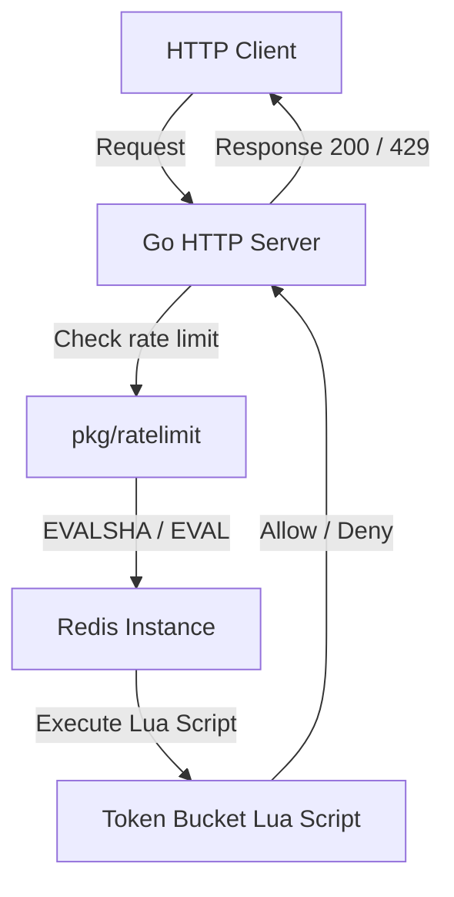

# Distributed Rate Limiter

A high-performance, distributed rate limiter implementation in Go using the **Token Bucket** strategy backed by **Redis** and **Lua scripting**.

This rate limiter is designed for high-concurrency environments, ensuring atomicity and consistency across multiple distributed instances without race conditions or clock drift issues.

---

## Architecture Overview



---

## Features

- **Distributed Token Bucket Algorithm:** Uses Redis for state storage and dynamic token accumulation.
- **Atomic Operations:** Uses a Redis Lua script to query and update the bucket state atomically, preventing race conditions.
- **Server Clock Synchronization:** Retrieves current time from the Redis server (`redis.call('TIME')`) so rate limiting stays synchronized across all application nodes regardless of individual machine clock drifts.
- **EVALSHA Performance Optimization:** Pre-loads the Lua script into Redis at startup and executes requests via `EVALSHA` to minimize network overhead.
- **Connection Cache Manager:** Caches and reuses Redis clients by address to prevent connection/thread pool exhaustion.
- **Concurrency-Safe Server:** Implements a thread-safe double-checked lock pattern on the Go server side to safely manage multiple rate limiter instances concurrently.

---

## Project Structure

```
.
├── cmd/
│   └── server/
│       └── main.go       # Go HTTP server demonstrating rate-limiter usage
├── pkg/
│   └── ratelimit/
│       ├── limiter.go     # Core rate limiting logic and constructor
│       ├── limiter_test.go# Unit & integration tests
│       ├── lua.go         # Token bucket Lua script definition
│       └── redis.go       # Cached Redis client connection pool manager
├── go.mod
├── go.sum
└── README.md
```

---

## Getting Started

### Prerequisites

- Go (1.24 or higher)
- Redis server running on `localhost:6379` (configurable in `main.go`)

### Running the Server

Start the Go HTTP server:

```bash
go run cmd/server/main.go
```

The server will start listening on port `:8091`. Every request to the server is rate-limited using the Token Bucket strategy.

### Running Tests

Execute the unit/integration tests:

```bash
go test -v ./pkg/ratelimit/...
```

---

## Token Bucket Algorithm Details

1. **Capacity ($C$):** The maximum number of tokens a bucket can hold (e.g., 100).
2. **Window ($W$):** The timeframe in seconds over which the refill occurs (e.g., 60 seconds).
3. **Refill Rate ($R$):** Computed as $C / W$ tokens per second.
4. **Calculations in Lua:**
   - On each request, the elapsed time since the last request is computed using Redis server time.
   - Tokens to add = $\text{elapsed\_time\_seconds} \times R$.
   - The token count is updated: $\min(C, \text{tokens} + \text{tokens\_to\_add})$.
   - If $\ge 1$ token is available, the token is consumed (decrement by 1), the operation is allowed, and the key's TTL is refreshed to $W$ seconds.
   - Otherwise, the request is blocked.
